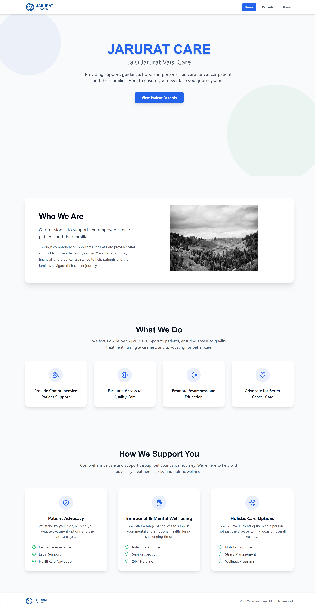
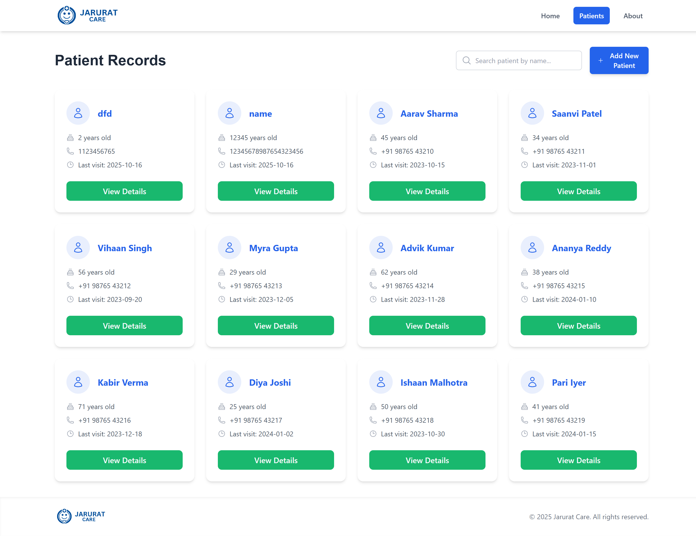
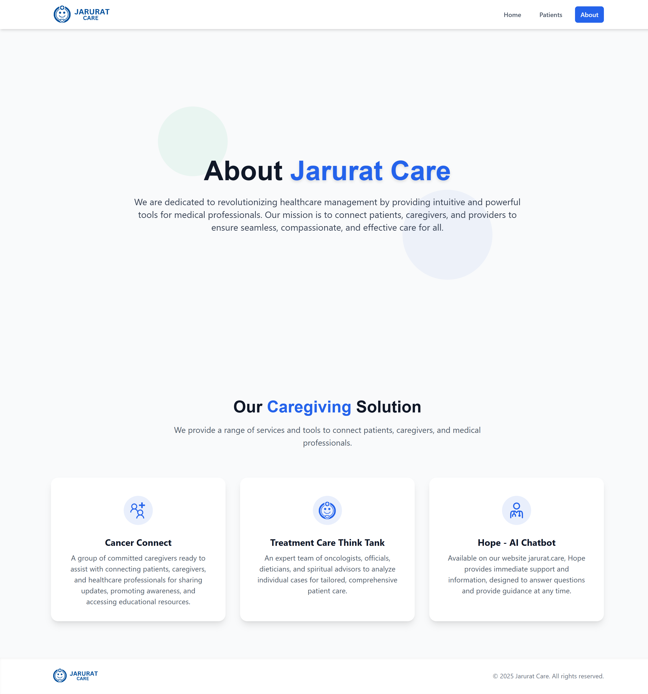

# 🚀 React Frontend Project

This is a frontend-only React project built using **Vite**.

## 🛠️ How to Run the Project

Follow the steps below to set up and run this project on your local machine.

### 1️⃣ Clone the repository

```
git clone https://github.com/Harshil-0707/jarurat_care.git
```

### 2️⃣ Navigate into the project directory

```
cd jarurat_care
```

### 3️⃣ Install dependencies

```
npm i
```

### 4️⃣ Start the development server

```
npm run dev
```

### 5️⃣ Open the project in your browser

After running the above command, open the URL shown in your terminal (usually):

```
http://localhost:5173
```

## Screenshots

Home page



Patients page



About page


